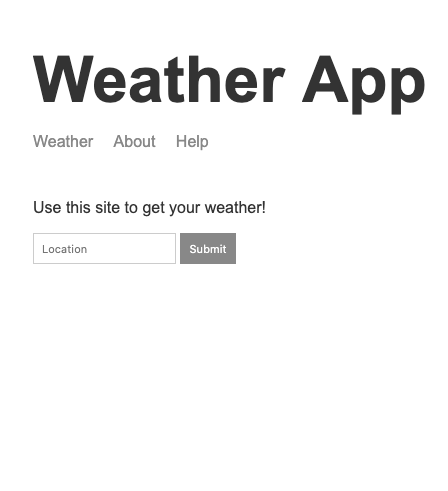

# Weather App



Weather app to give you the forecast of any location in the world.

You can visit the app [here](https://shubham-weatherapp.herokuapp.com/)

## Server

The server is made on `nodejs` (v12.4.0)

`Express.js` is used as the server framework

## Frontend

The frontend is made with `HTML, CSS and Vanilla JS`

## API

*  It uses [Mapbox](https://www.mapbox.com/) api for geocoding the location text into geographic coordinates.
  **Ex** - `2 Lincoln Memorial Circle NW` into `-77.050,38.889`.

*  It uses [Darksky](https://darksky.net/dev) to fetch the weather data by provding the geographic coordinates.

---

## For Developers

### NPM Commands

*  `npm i` install all dependencies

```terminal
npm i
```

*  `npm run start` starts the server

```terminal
npm run start
```

---

Leave a star :star: , if you like :+1: it.
